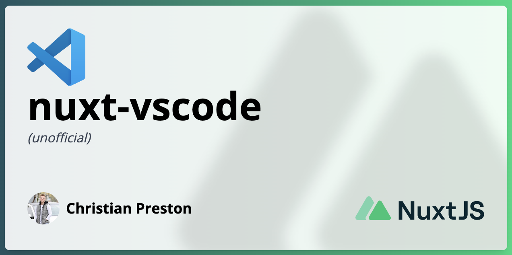

<!-- <div
	class="relative bg-gradient-to-r from-[#255461] to-[#00DC82] h-full font-open-sans bg-cover bg-center p-2"
>
	<div class="bg-white bg-opacity-90 rounded-md shadow-lg h-full p-7 flex flex-col justify-between">
        <div>
          
    	  <h1 class="text-4xl font-bold line-clamp-3 pb-1">{{ title }}</h1>
          <p class="text-gray-700 italic">(un-official)</p>
        </div>
		<div class="mt-3 flex items-center justify-between">
			<div class="flex items-center space-x-2 text-lg">
				
				<span class="font-semibold">{{ author }}</span>
			</div>
			<div>
				
			</div>
		</div>
	</div>
</div> -->


<h1 align="center">nuxt-vscode (un-official)</h1>

<p align="center">
  This uses <a href="https://v3.nuxtjs.org/api/commands/add/" target="_blank">nuxi</a> but makes it interactive and easy to use with a nuxt 3 project.
</p>

<p align="center">
  <a href="https://marketplace.visualstudio.com/items?itemName=cpreston321.nuxt-vscode#review-details">
    
  </a> 
  <a href="https://marketplace.visualstudio.com/items?itemName=cpreston321.nuxt-vscode">
    
  </a>
</p>

> Nuxi commands for vscode. This extension is not affiliated with Nuxt.js.

## Features

- 📖 Open Source
- 🚀 Built for [Nuxt 3](https://v3.nuxtjs.org) Project
- ✨ Nuxi built into **VS Code**.
- Full Typescript Support

## Prerequisites

- [VS Code](https://code.visualstudio.com/) `v1.71.0 or greater`
- [Nuxi CLI](https://v3.nuxtjs.org/api/commands/add/) `latest`

Install Nuxi CLI Globally

```bash
npm i -g nuxi
```

## 💻 Development

- Clone this repository
- Enable [Corepack](https://github.com/nodejs/corepack) using `corepack enable`
- Install dependencies using `pnpm install`
- Open playground with `pnpm dev`

## ➕ Contributing

Contributions are what make the open source community such an amazing place to be learn, inspire, and create. Any contributions you make are **greatly appreciated**.

1. Fork the Project
2. Create your Feature Branch (`git checkout -b feature/AmazingFeature`)
3. Commit your Changes (`git commit -m 'Add some AmazingFeature'`)
4. Push to the Branch (`git push origin feature/AmazingFeature`)
5. Open a Pull Request

## Credits

[`nuxi`](https://v3.nuxtjs.org/api/commands/add/) is developed by [@nuxt](https://github.com/nuxt).

## 📜 License

[MIT](./LICENSE) License © 2022 [cpreston321](https://github.com/cpreston321)

# 📧 Contact

cpreston321 - [@cpreston321](https://twitter.com/cpreston321)

Also, if you like my work, please feel free to [buy me a coffee](https://www.buymeacoffee.com/cpreston321) ☕️

<a href="https://www.buymeacoffee.com/cpreston321" target="_blank">
  
</a>
